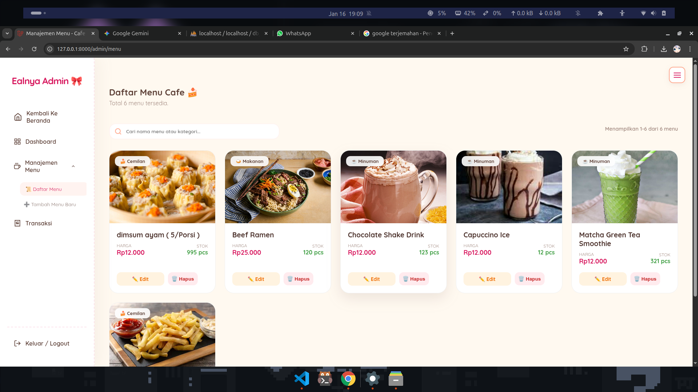
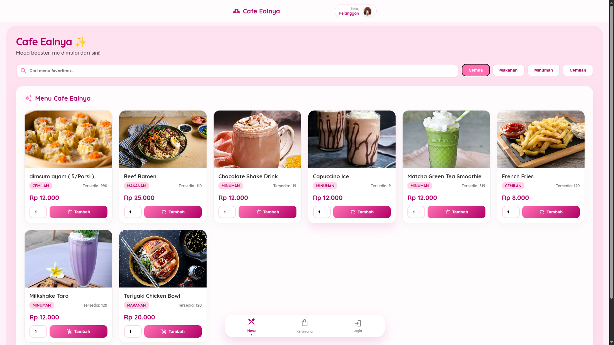
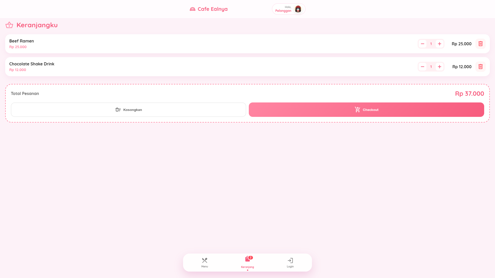
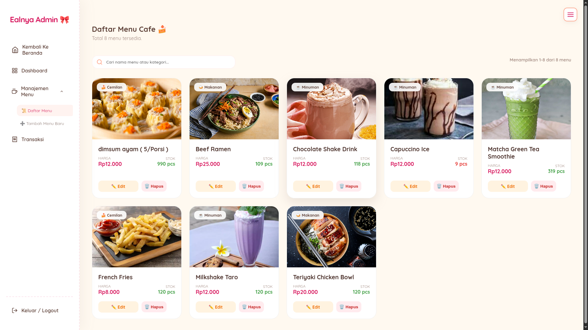
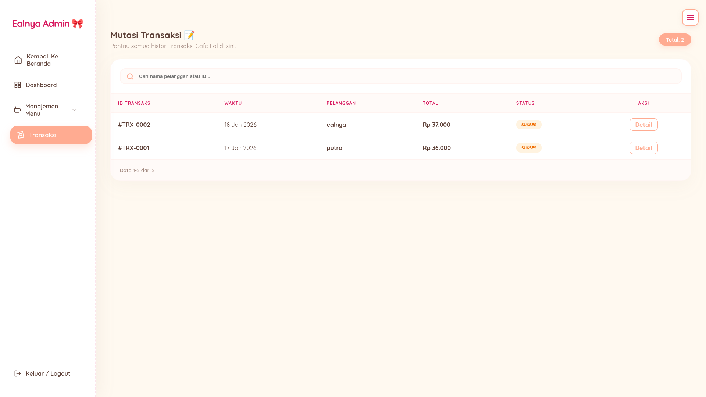

## Setup Awal

Setelah tombol **Setup Aplikasi** di halaman login diklik, seluruh data awal akan otomatis dimasukkan.

### Akun Admin
- **Email:** ealnya@gmail.com  
- **Password:** 123123  

## Catatan Penting

Jika gambar menu tidak muncul:
1. Pastikan seluruh file backup gambar berada di:
storage/app/public/menu/

2. Jika masih tidak tampil:
- Hapus symlink di `public/` (ikon panah patah)
- Jalankan ulang:
  ```bash
  php artisan storage:link
  ```

## Preview




## Tampilan Lain



